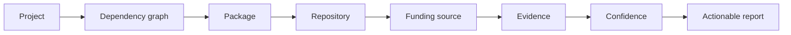
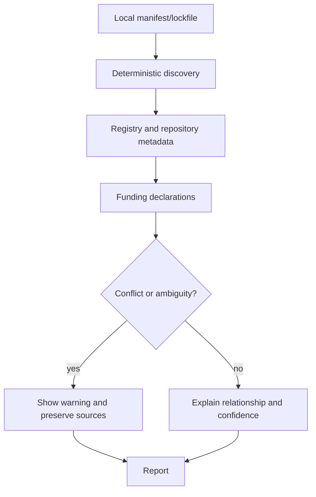

# FundGraph

FundGraph is a local-first CLI and library that shows where funding pathways for your open-source dependencies are declared—and the evidence behind each result.

FundGraph is a multi-repository project consisting of three independent repositories contained within the `FundGraph` workspace.

| Repository | Responsibility | Publishability |
|---|---|---|
| `fundgraph` | Project mission, governance, roadmap, cross-repository docs, release coordination, examples, integration fixtures | Project coordination repository; not an implementation package |
| `fundgraph-core` | Reusable domain model, dependency graph, adapters, evidence, resolution, reports, and library tests | Independently publishable library |
| `fundgraph-cli` | `fundgraph` executable, CLI UX, exit codes, packaging, and CLI tests | Independently publishable executable |

Dependency direction: `fundgraph-cli` depends on a versioned `fundgraph-core` release. The parent `FundGraph` directory is only a workspace container and must not contain `.git`.

It answers: **who maintains the software I depend on, where can it be funded, and what supports that relationship?** It does not move money, manage wallets, execute payments, or automatically donate.

## Status

Phases 0–6 are complete. The reusable domain/model API, dependency discovery, recorded registry metadata normalization, evidence-backed funding parsers, and explicit relationship resolution are implemented in `fundgraph-core`, and the CLI foundation is implemented in `fundgraph-cli`. Deterministic reports remain the next phase. The v0.1 target is npm, PyPI, and Cargo, subject to the roadmap acceptance criteria.

## Product flow





## Planned 60-second example

```text
$ fundgraph analyze . --format text
FundGraph analysis: 18 dependencies, 7 funding pathways

lodash -> https://github.com/lodash/lodash
  funding: https://opencollective.com/lodash
  confidence: medium
  evidence: package.metadata.funding, repository.url
  note: review endpoint before taking action
```

The example becomes executable when Phase 2 and the relevant adapters land; until then it is an interface sketch, not a claim about current output.

## Documentation ownership

Project-level documentation lives in the `fundgraph` repository. Repository-specific API, CLI, testing, and development documentation lives beside the implementation in `fundgraph-core` or `fundgraph-cli`. Start here for cross-repository decisions; start in the relevant implementation repository for code changes.

## Installation and development

Installation will be documented with the first packaged release. During Phase 0 there is no executable package. The development contract is recorded in [`docs/TESTING.md`](docs/TESTING.md); planned checks are `npm run lint`, `npm run typecheck`, `npm test`, and `npm run build` after Phase 1 establishes tooling.

## Evidence and security

Every result must retain source evidence, retrieval context, a relationship rule, and a confidence level. Conflicts remain visible. Inputs and remote metadata are untrusted; FundGraph will not execute them, require private credentials, or send private source code to external services. See [`docs/EVIDENCE_MODEL.md`](docs/EVIDENCE_MODEL.md) and [`docs/SECURITY.md`](docs/SECURITY.md).

## Scope and roadmap

The complete executable plan is in [`ROADMAP.md`](ROADMAP.md). Current state is in [`PROJECT_STATE.md`](PROJECT_STATE.md). Start with [`PROJECT_CONTEXT.md`](PROJECT_CONTEXT.md), then [`docs/PROJECT_CHARTER.md`](docs/PROJECT_CHARTER.md).

## Contributing

See [`CONTRIBUTING.md`](CONTRIBUTING.md), [`docs/CONTRIBUTOR_GUIDE.md`](docs/CONTRIBUTOR_GUIDE.md), and [`CODE_OF_CONDUCT.md`](CODE_OF_CONDUCT.md). FundGraph is independent of the author's other projects. The project is intentionally split into three independent repositories, not a monorepo.

