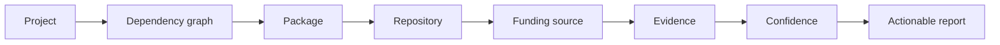
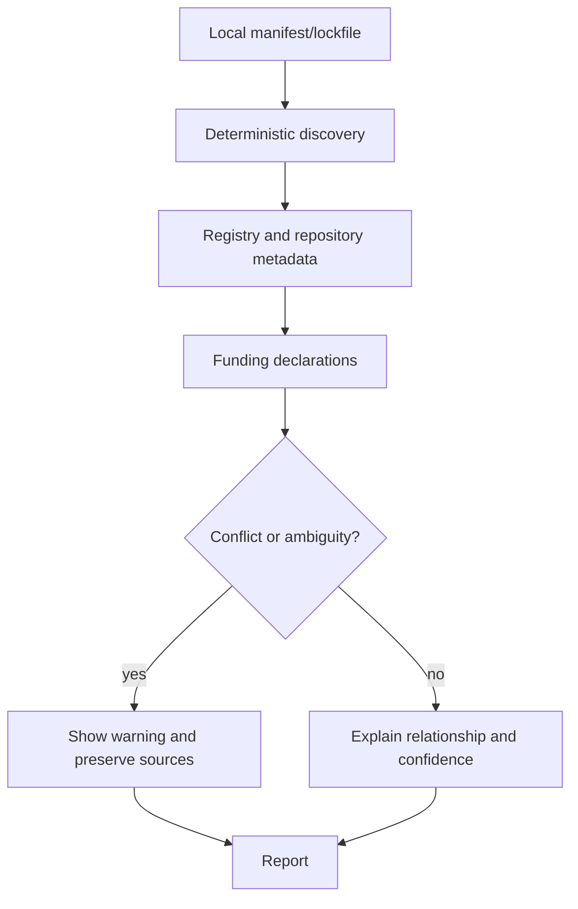

# FundGraph

FundGraph is a local-first CLI and library that shows where funding pathways for your open-source dependencies are declared—and the evidence behind each result.

FundGraph is a multi-repository project consisting of three independent repositories contained within the `FundGraph` workspace.

| Repository | Responsibility | Publishability |
|---|---|---|
| `fundgraph` | Project mission, governance, roadmap, cross-repository docs, release coordination, examples, integration fixtures | Project coordination repository; not an implementation package |
| `fundgraph-core` | Reusable domain model, dependency graph, adapters, evidence, resolution, reports, and library tests | Independently publishable library |
| `fundgraph-cli` | `fundgraph` executable, CLI UX, exit codes, packaging, and CLI tests | Independently publishable executable |

Dependency direction: `fundgraph-cli` depends on a versioned `fundgraph-core` release. The parent `FundGraph` directory is only a workspace container and must not contain `.git`.

It answers: **who maintains the software I depend on, where can it be funded, and what supports that relationship?** It does not move money, manage wallets, execute payments, or automatically donate.

## Status

Phases 0–14 are complete. The reusable domain/model API, dependency discovery, recorded registry metadata normalization, evidence-backed funding parsers, explicit relationship resolution, deterministic reports, opt-in network reliability, security hardening, comprehensive integration fixtures, and cross-platform CI are implemented in `fundgraph-core`; `fundgraph-cli` renders the report while retaining its stable summary contract. Baseline Go `go.mod` discovery is available as the first v1 expansion; Go metadata/funding support remains future scope.

See [RELEASE_NOTES_v0.1.0.md](RELEASE_NOTES_v0.1.0.md) and [FINAL_AUDIT.md](FINAL_AUDIT.md) for the local release candidate status and known limitations.

For funding applications, see [FUNDING_SUBMISSION.md](FUNDING_SUBMISSION.md). It contains factual positioning and proposed milestones without claiming adoption, eligibility, or acceptance.

## Product flow





## 60-second example

```text
$ fundgraph analyze ./my-project --format text --offline
FundGraph analysis
Input: ./my-project
Models: 3
Edges: 2
Ecosystems: npm
Offline: yes

FundGraph report
Schema: 1.0
Dependencies: 2
Packages: 0
Repositories: 0
Funding sources: 0
Evidence: 0
Relationships: 0
```

The exact counts depend on the local project. Text output preserves diagnostics and limitations; JSON output adds the versioned `report` object for automation.

## Documentation ownership

Project-level documentation lives in the `fundgraph` repository. Repository-specific API, CLI, testing, and development documentation lives beside the implementation in `fundgraph-core` or `fundgraph-cli`. Start here for cross-repository decisions; start in the relevant implementation repository for code changes.

## Installation and development

For the v0.1 release, install the independently published packages after the maintainer creates the GitHub/npm release:

```text
npm install -g fundgraph
fundgraph analyze ./my-project --format text --offline
```

For local development, build `fundgraph-core`, install it into `fundgraph-cli` from the sibling path, then run the checks documented in [`docs/TESTING.md`](docs/TESTING.md). The project repository itself is coordination documentation, not the executable package.

## Evidence and security

Every result must retain source evidence, retrieval context, a relationship rule, and a confidence level. Conflicts remain visible. Inputs and remote metadata are untrusted; FundGraph will not execute them, require private credentials, or send private source code to external services. See [`docs/EVIDENCE_MODEL.md`](docs/EVIDENCE_MODEL.md) and [`docs/SECURITY.md`](docs/SECURITY.md).

## Scope and roadmap

The complete executable plan is in [`ROADMAP.md`](ROADMAP.md). Current state is in [`PROJECT_STATE.md`](PROJECT_STATE.md). Start with [`PROJECT_CONTEXT.md`](PROJECT_CONTEXT.md), then [`docs/PROJECT_CHARTER.md`](docs/PROJECT_CHARTER.md).

## Contributing

See [`CONTRIBUTING.md`](CONTRIBUTING.md), [`docs/CONTRIBUTOR_GUIDE.md`](docs/CONTRIBUTOR_GUIDE.md), and [`CODE_OF_CONDUCT.md`](CODE_OF_CONDUCT.md). FundGraph is independent of the author's other projects. The project is intentionally split into three independent repositories, not a monorepo.
