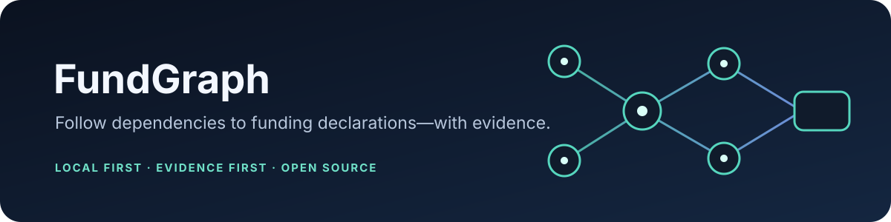
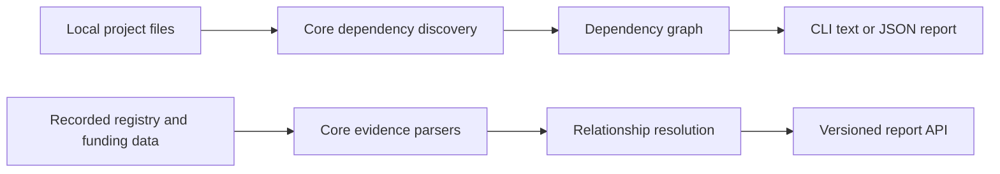

<p align="center">
  
</p>

<p align="center">
  <a href="LICENSE"></a>
  
  
</p>

<p align="center"><strong>See what your dependencies declare about funding—and inspect the evidence behind each relationship.</strong></p>

FundGraph is a local-first CLI and TypeScript library for dependency and funding-pathway analysis. It keeps source claims,
conflicts, and uncertainty visible so maintainers and funders can review the result.

> Current scope: the CLI discovers dependency graphs locally. Core library APIs parse recorded npm/PyPI/Cargo metadata
> and funding evidence, resolve relationships, and create reports. The CLI does not yet orchestrate that full funding
> analysis for arbitrary projects.

## At a glance

| Repository | Owns | Start here when you are… |
|---|---|---|
| `fundgraph` | Product definition, roadmap, governance, cross-repository docs, and release coordination | deciding scope or understanding the whole project |
| `fundgraph-core` | Models, dependency discovery, evidence parsers, resolution, reports, and library tests | changing library behavior or adding a fixture/provider |
| `fundgraph-cli` | The `fundgraph` command, output, exit codes, packaging, and CLI tests | changing command behavior or terminal output |

These are three independent repositories in the `FundGraph` workspace. `fundgraph-cli` depends on the published
`@fundgraph/core` package. The workspace parent is not a Git repository.

## How it works



The current command analyzes local inputs for npm, PyPI, Cargo, and baseline Go `go.mod` requirements. The evidence and
relationship APIs support recorded npm/PyPI/Cargo data. Go metadata and funding providers are future scope.

## Try it locally

The packages are not published yet. From the workspace containing all three repositories:

```sh
cd fundgraph-core
npm ci
npm run build

cd ../fundgraph-cli
npm install --ignore-scripts --no-save ../fundgraph-core
npm run build
node dist/main.js --help
node dist/main.js analyze ../fundgraph-core/test/fixtures/npm-workspace --format text --offline
node dist/main.js analyze ../fundgraph-core/test/fixtures/npm-workspace --format json --offline
```

After the maintainer publishes compatible npm packages, installation will be:

```sh
npm install -g fundgraph
fundgraph analyze ./my-project --format text --offline
```

## Evidence and safety

- Funding URLs are declarations to review, not endorsements or verified payment destinations.
- Multiple or contradictory sources stay separate; ambiguous relationships are not silently guessed.
- The system does not infer human identity, move money, manage wallets, or execute payments.
- Project files are treated as data. Directory analysis is local and does not make hidden network requests.
- Network helpers live in core and require explicit caller configuration; DNS isolation remains an operational responsibility.

## Documentation

Start with [`PROJECT_CONTEXT.md`](PROJECT_CONTEXT.md), [`PROJECT_STATE.md`](PROJECT_STATE.md), and [`ROADMAP.md`](ROADMAP.md).
The product contract is in [`docs/PROJECT_CHARTER.md`](docs/PROJECT_CHARTER.md) and [`docs/ARCHITECTURE.md`](docs/ARCHITECTURE.md).
The local release status is in [`FINAL_AUDIT.md`](FINAL_AUDIT.md); the factual funding brief is in
[`FUNDING_SUBMISSION.md`](FUNDING_SUBMISSION.md).

## Contributing

Read [`CONTRIBUTING.md`](CONTRIBUTING.md) and [`docs/CONTRIBUTOR_GUIDE.md`](docs/CONTRIBUTOR_GUIDE.md). Use
[`docs/GOOD_FIRST_ISSUES.md`](docs/GOOD_FIRST_ISSUES.md) for starter work and [`docs/ADAPTER_GUIDE.md`](docs/ADAPTER_GUIDE.md)
for fixture-first core contributions. See [`PUBLISHING_HANDOFF.md`](PUBLISHING_HANDOFF.md) for the maintainer's final
GitHub release steps.

For repository descriptions and GitHub topic tags, use [`GITHUB_REPOSITORY_METADATA.md`](GITHUB_REPOSITORY_METADATA.md).
