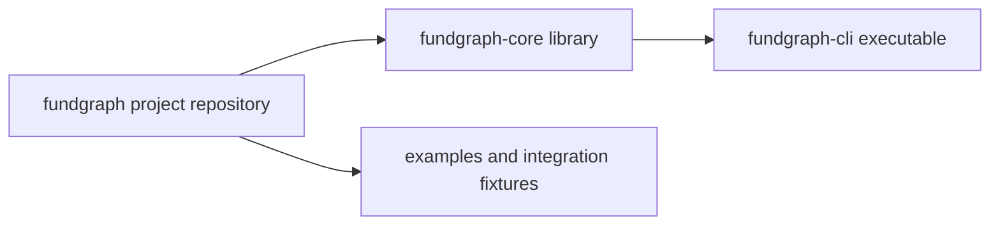
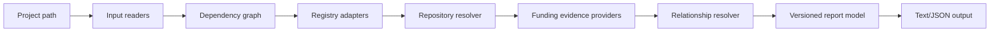

# Architecture

The repository boundaries are:

| Repository | Belongs | Does not belong | Public API / release responsibility |
|---|---|---|---|
| `fundgraph` | Mission, governance, roadmap, cross-repository docs, examples, fixtures, release coordination | Runtime library, CLI implementation, duplicated package source | Project-level compatibility policy and coordinated release notes; not an installable runtime package |
| `fundgraph-core` | Versioned domain models, inputs, adapters, evidence, resolution, reporting, library tests | Terminal UX, process exit handling, project-wide governance | Publish the reusable library API and its own SemVer/package artifacts |
| `fundgraph-cli` | Argument parsing, terminal output, config, exit codes, CLI tests and executable packaging | Domain logic copied from core, project-wide docs, payment functionality | Publish the `fundgraph` executable and document its supported core range |

`fundgraph-cli` depends on `fundgraph-core` through a versioned package relationship. The project repository does not use submodules or worktrees and is not a fourth parent repository; its filesystem parent is only a container.

The system has six boundaries: input readers, normalized domain core, public metadata adapters, relationship/evidence resolution, network reliability, and presentation. Adapters return evidence-bearing data; they do not decide truth independently. The core is deterministic and side-effect-light. Network access is injected behind explicit interfaces so tests use fixtures. The network boundary owns retries, timeout/cancellation behavior, rate-limit backoff, opt-in cache policy, offline replay, and partial-result semantics; parsers remain pure.

`fundgraph-core` uses `src/domain` for models and validation, `src/inputs` for manifest/lockfile readers, `src/metadata` for registry/repository normalization, `src/funding` for evidence parsers, `src/resolution` for relationship rules, `src/reporting` for serializers, `src/network` for injected request reliability and cache controls, and repository-local fixtures for deterministic inputs/responses. Phase 14 adds baseline Go `go.mod` discovery in `src/inputs/go.ts`; it does not execute the Go toolchain, fetch modules, parse `go.work`, or add Go metadata/funding providers. `fundgraph-cli` uses `src/options` and `src/main`.

