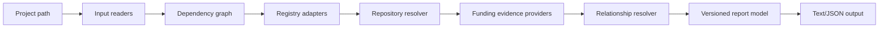

# Architecture

The system has five boundaries: input readers, normalized domain core, public metadata adapters, relationship/evidence resolution, and presentation. Adapters return evidence-bearing data; they do not decide truth independently. The core is deterministic and side-effect-light. Network access is injected behind explicit interfaces so tests use fixtures.

Suggested layout: `src/domain` for models and validation, `src/inputs` for manifest/lockfile readers, `src/adapters` for registries/providers, `src/resolution` for relationship rules, `src/reporting` for serializers, `src/cli` for command parsing, and `fixtures/` for deterministic inputs/responses.

